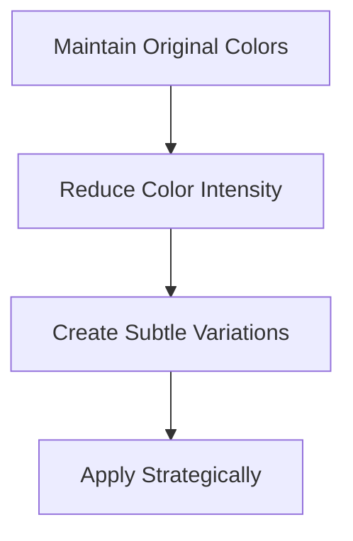
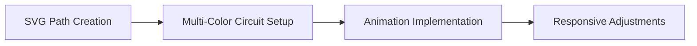
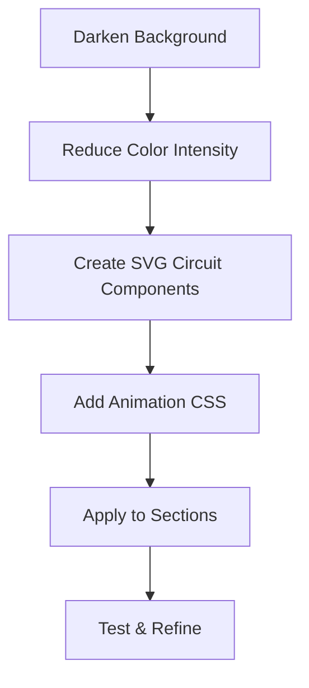

# Cyborg Dev Landing Page Redesign Plan

## 1. Color Palette Adjustments



### Current vs. Refined Color Scheme
```
Current:
- Primary background: #050505
- Secondary background: #080808
- Tertiary background: #0c0c0c
- Accent colors (solid):
  - Orange-Red: #FF4931 (Primary)
  - Purple: #9e57b3 (Secondary)
  - Vivid Green: #1AFB6F (Tertiary)
  - Blue: #267AD2 (Links/Other)

Refined (Same colors but more subtle):
- Primary background: #000000 (Pure black like Next.js)
- Secondary background: #080808 (Keep existing)
- Tertiary background: #0c0c0c (Keep existing)
- Accent colors (subtle versions):
  - Orange-Red: rgba(255, 73, 49, 0.15) to rgba(255, 73, 49, 0.4)
  - Purple: rgba(158, 87, 179, 0.15) to rgba(158, 87, 179, 0.4)
  - Vivid Green: rgba(26, 251, 111, 0.15) to rgba(26, 251, 111, 0.4)
  - Blue: rgba(38, 122, 210, 0.15) to rgba(38, 122, 210, 0.4)
```

## 2. Circuit Animation Design

### Circuit Line Implementation
- Create SVG paths representing circuit lines connecting key sections/components
- Use the original colors but with very low opacity (0.15-0.4) for circuit lines
- Implement subtle animated gradient effect along the paths
- Position circuit paths strategically to lead the eye through content

### Animation Specifications



1. **SVG Path Design**
   - Thin, precise paths (0.5-1px width) connecting UI elements
   - 90° angles and orthogonal lines similar to Next.js design
   - Multiple paths with different lengths and routes

2. **Color Application**
   - Each section uses its own color theme for circuit lines:
     - Orange-Red circuits in Hero section
     - Purple circuits in Testimonials section
     - Green circuits in Vision section
     - Blue circuits in Challenges section

3. **Animation Techniques**
   - Use `stroke-dasharray` and `stroke-dashoffset` for moving dash effect
   - Implement subtle opacity pulsing (0.15 to 0.4)
   - Create the illusion of data/light flowing through the circuit
   - Multiple animation speeds and directions for organic feel

## 3. Subtle Styling Modifications

### Glow Effect Reduction
- Reduce all glow effects by 80% while maintaining color identity
- Replace solid color borders with more subtle linear gradients
- Use semi-transparent accents rather than solid colors for highlights
- Maintain the dark theme but deepen the background to pure black (#000000)

### Background Pattern Refinement
```css
.tech-pattern {
  background-image:
    radial-gradient(rgba(26, 251, 111, 0.03) 1px, transparent 1px),
    radial-gradient(rgba(158, 87, 179, 0.03) 1px, transparent 1px);
  background-size: 30px 30px;
  background-position: 0 0, 15px 15px;
  background-color: var(--bg-primary);
}
```

## 4. Circuit Animation Implementation

### SVG Circuit Layout
Each section will have its own circuit pattern with its corresponding color theme:

```
+------------------+
|     HEADER       |
+-----|---------|--+
      |         |
      v         v
+------------------+
|   HERO SECTION   |---> (Orange-Red circuits)
+----|----|--------+
     |    |
     v    v
+------------------+
|  DÉFIS SECTION   |---> (Blue circuits)
+----|----|--------+
     |    |
     v    v
+------------------+
| TÉMOIGNAGES SEC  |---> (Purple circuits)
+----|----|--------+
     |    |
     v    v
+------------------+
|  VISION SECTION  |---> (Green circuits)
+----|----|--------+
     |    |
     v    v
+------------------+
|     FOOTER       |
+------------------+
```

### CSS Implementation

```css
@keyframes flowAnimation {
  0% {
    stroke-dashoffset: 1000;
    opacity: 0.15;
  }
  50% {
    opacity: 0.4;
  }
  100% {
    stroke-dashoffset: 0;
    opacity: 0.15;
  }
}

.circuit-line {
  stroke-width: 1px;
  fill: none;
  stroke-dasharray: 5, 10;
  opacity: 0.15;
  filter: drop-shadow(0 0 1px currentColor); /* Very subtle glow */
  animation: flowAnimation 15s linear infinite;
}

.circuit-orange-red {
  stroke: rgba(255, 73, 49, 0.7);
}

.circuit-purple {
  stroke: rgba(158, 87, 179, 0.7);
}

.circuit-green {
  stroke: rgba(26, 251, 111, 0.7);
}

.circuit-blue {
  stroke: rgba(38, 122, 210, 0.7);
}

/* Different timing for organic feel */
.delay-1 { animation-delay: -2s; }
.delay-2 { animation-delay: -5s; }
.delay-3 { animation-delay: -9s; }
```

### SVG Component Structure
```html
<div class="circuit-container">
  <!-- Hero Section Circuits (Orange-Red) -->
  <svg class="circuit-svg" viewBox="0 0 1200 800" preserveAspectRatio="none">
    <path class="circuit-line circuit-orange-red delay-1" d="M100,100 L300,100 L300,300" />
    <path class="circuit-line circuit-orange-red delay-2" d="M500,150 L700,150 L700,250 L900,250" />
    <!-- Additional paths -->
  </svg>
  
  <!-- Additional SVGs for other sections with respective colors -->
</div>
```

## 5. Implementation Strategy



### Phase 1: Color Subtlety Adjustments
1. Update background to pure black (#000000)
2. Reduce intensity of all colored elements by applying transparency
3. Replace solid color borders with subtle gradients
4. Update glowing effects to be 80% more subtle

### Phase 2: Circuit Animation Development
1. Create SVG paths for each section with corresponding color theme
2. Implement CSS animations for flowing effect
3. Position circuit lines to connect key UI elements
4. Add subtle glow effects to enhance visibility

### Phase 3: Integration & Testing
1. Ensure animations don't impact performance
2. Test responsive behavior across devices
3. Validate accessibility with reduced color intensity
4. Fine-tune animation timings and synchronization

## 6. Technical Specifications

### SVG Circuit Path Creation
- Each section needs 3-5 circuit paths
- Paths should follow grid-like patterns with 90° turns
- Primary directions: horizontal paths connecting to vertical offshoots
- Variable path lengths (short, medium, long) for visual interest

### Animation Performance Considerations
- Limit total number of animated paths to 15-20 across the entire page
- Use CSS animations instead of JavaScript for better performance
- Consider `will-change: opacity, stroke-dashoffset` for rendering optimization
- Implement animation reduction for users with reduced motion preferences

### Responsive Behavior
- Simplify circuit paths on mobile devices
- Adjust path coordinates based on viewport size using media queries
- Consider hiding some paths on smaller screens to maintain performance

## 7. Final Design Principles

1. **Color Application Strategy**
   - Use original colors but with significantly reduced opacity
   - Apply colors consistently within their respective sections
   - Maintain the existing color meaning/hierarchy

2. **Animation Subtlety Guidelines**
   - Animations should be noticeable but not distracting
   - Circuit flow should enhance rather than dominate the design
   - Timing should be slow enough to create a calm, sophisticated effect

3. **Dark Theme Enhancement**
   - Pure black creates more dramatic contrast for subtle colored elements
   - Reduced color intensity creates a more premium, sophisticated look
   - Circuit animations provide visual interest without overwhelming color