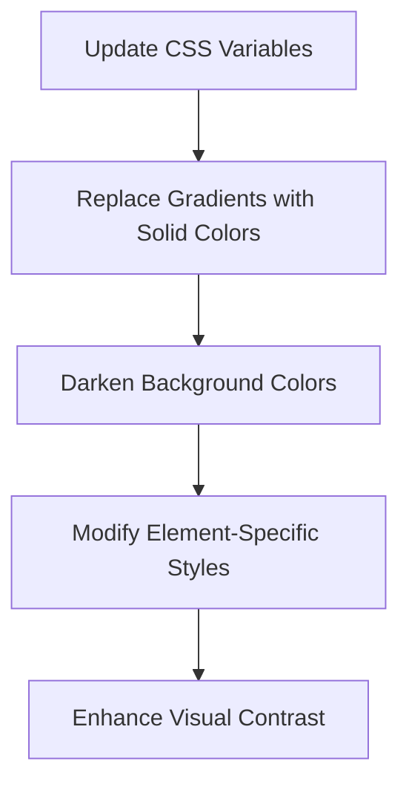

# Plan for Revising the Visual Styling of "Cyborg Dev" Landing Page

## 1. Color Palette Updates

### Current vs. New Color Scheme
```
Current:
- Primary background: #0a0a0a
- Secondary background: #121212
- Gradients using: teal #00B8D4, cyan #00e5ff, violet #7b00ff

New:
- Primary background: #050505 (darker than current)
- Secondary background: #080808 (darker than current)
- Section backgrounds: #0c0c0c (for contrast)
- Accent colors (solid):
  - Orange-Red: #FF4931 (Primary: buttons, main highlights)
  - Purple: #9e57b3 (Secondary: highlights, some text)
  - Vivid Green: #1AFB6F (Tertiary: icons, details)
  - Blue: #267AD2 (Links/Other)
```

## 2. Specific CSS Modifications



### CSS Variable Updates
```css
:root {
    --bg-primary: #050505; /* Darker than current #0a0a0a */
    --bg-secondary: #080808; /* Darker than current #121212 */
    --bg-tertiary: #0c0c0c; /* For card backgrounds */
    --accent-orange-red: #FF4931; /* Primary */
    --accent-purple: #9e57b3;    /* Secondary */
    --accent-green: #1AFB6F;     /* Tertiary */
    --accent-blue: #267AD2;      /* Links/Other */
    --text-primary: #ffffff;
    --text-secondary: #a0a0a0;
}
```

### Gradient Removal
1. Replace the `.gradient-text` class to use solid color instead of gradient:
```css
.gradient-text { /* Note: Class name kept, but style changed to solid color */
    color: var(--accent-orange-red);
    font-weight: bold;
}
```

2. Replace gradient buttons with solid red:
```css
.btn-primary {
    background-color: var(--accent-orange-red);
    transition: all 0.3s ease;
}
```

3. Replace the hero gradient overlay:
```css
.hero-gradient {
    background: rgba(5, 5, 5, 0.85);
}
```

4. Update the tech pattern background:
```css
.tech-pattern {
    background-image:
        radial-gradient(rgba(26, 251, 111, 0.08) 1px, transparent 1px), /* Green */
        radial-gradient(rgba(158, 87, 179, 0.08) 1px, transparent 1px); /* Purple */
    background-size: 30px 30px;
    background-position: 0 0, 15px 15px;
    background-color: var(--bg-primary);
}
```

### Element-Specific Updates

1. **Headings & Text**
   - Use Orange-Red for main headings and important text
   - Apply Purple to subheadings
   - Use Vivid Green or Blue for special callouts and icons

2. **Buttons & CTAs**
   - Primary buttons: Orange-Red background
   - Secondary buttons: Purple border with transparent background
   - Hover effects: Subtle brightness change rather than gradients

3. **Cards & Containers**
   - Card backgrounds: #0c0c0c (slightly lighter than page background)
   - Card borders: Solid 2px with accent colors
   - Apply Vivid Green or Blue to icons within cards

4. **Glowing Effects**
   - Replace gradient glows with solid color glows:
   ```css
   .glow-orange-red {
       box-shadow: 0 0 15px rgba(255, 73, 49, 0.5);
   }
   
   .glow-purple {
       box-shadow: 0 0 15px rgba(158, 87, 179, 0.5);
   }
   
   .glow-green {
       box-shadow: 0 0 15px rgba(26, 251, 111, 0.5);
   }
    
   .glow-blue {
        box-shadow: 0 0 15px rgba(38, 122, 210, 0.5);
   }
   ```

## 3. HTML Modifications

1. **Update Class References**
   - Replace `glow-teal` with `glow-orange-red`
   - Replace `glow-violet` with `glow-purple`
   - Add `glow-green` and `glow-blue` where appropriate
   - Update any hardcoded color references

2. **Section Background Colors**
   - Apply darker backgrounds to all sections
   - Add additional classes for visual separation between sections

3. **Visual Emphasis**
   - Apply accent colors strategically to create focal points
   - Use Orange-Red (#FF4931) for primary CTAs and important headings
   - Apply Purple (#9e57b3) to secondary elements
   - Use Vivid Green (#1AFB6F) and Blue (#267AD2) for tertiary elements and icons

## 4. Implementation Strategy

### Phase 1: CSS Foundation Updates
1. Update all CSS variables with new color values
2. Modify base element styles to use the new colors
3. Replace all gradients with solid colors

### Phase 2: Component-Specific Updates
1. Update button styles to use Orange-Red
2. Modify card styles for darker backgrounds and solid color accents
3. Update the header and footer with darker backgrounds

### Phase 3: Visual Punch Elements
1. Add strategic accent colors to create visual hierarchy
2. Update hover effects to use solid colors
3. Enhance visual separation between sections

### Phase 4: Testing
1. Verify contrast ratios meet accessibility standards
2. Test responsiveness across different devices
3. Ensure consistent application of the new color scheme

## 5. Key Principles to Maintain Throughout

1. **Color Distribution**
   - Use Orange-Red (#FF4931) sparingly for high-impact elements (buttons, key headings)
   - Apply Purple (#9e57b3) to secondary elements (subheadings, some highlights)
   - Use Vivid Green (#1AFB6F) and Blue (#267AD2) for accent details and icons

2. **Visual Hierarchy**
   - Maintain clear visual hierarchy with strategic color use
   - Create depth with varying levels of darkness in backgrounds
   - Use solid colors to direct attention to key elements

3. **Brand Consistency**
   - Ensure consistent use of accent colors
   - Maintain the premium tech feel with the darker color palette
   - Keep all text content unchanged as requested