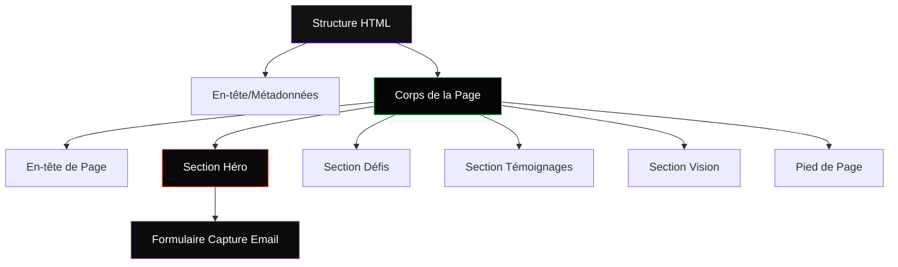
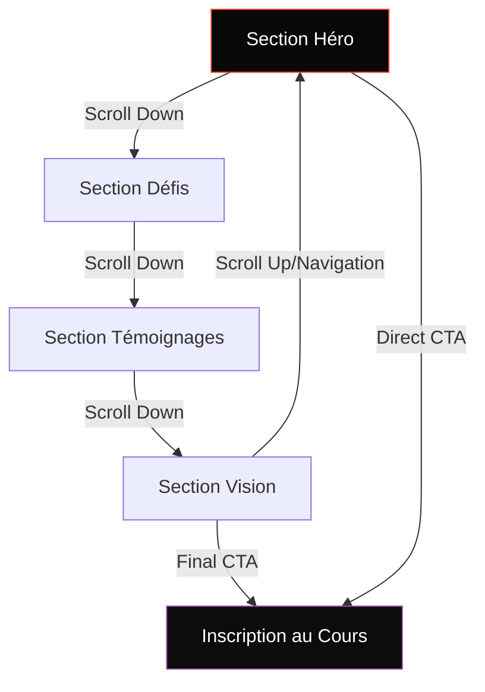

# Modèles Système: Cyborg Dev

## Architecture du Système

La page d'atterrissage "Cyborg Dev" est conçue comme une application web statique à page unique (Single Page) avec une architecture simple mais efficace, optimisée pour la performance et l'engagement des utilisateurs.



## Décisions Techniques Clés

### 1. Approche CSS First
Nous avons choisi une approche "CSS First" avec Tailwind CSS, minimisant l'utilisation de JavaScript pour plusieurs raisons:
- Meilleure performance (temps de chargement réduit)
- Moins de complexité et de points de défaillance
- Accessibilité améliorée
- Compatibilité plus large

### 2. Responsive Design avec Mobile-First
L'approche mobile-first garantit une expérience optimale sur tous les appareils:
- Conception initiale pour mobile
- Extension progressive pour les écrans plus grands
- Utilisation des classes responsive de Tailwind CSS

### 3. Conception Sombre Intense
La palette de couleurs très sombres (#050505, #080808, #0c0c0c) avec accents solides vifs (Orange-Rouge #FF4931, Violet #9e57b3, Vert Vif #1AFB6F, Bleu #267AD2) a été choisie pour:
- Communiquer un sentiment de haute technologie et d'intensité
- Créer un contraste élevé pour la lisibilité
- Mettre en valeur les éléments clés avec des couleurs d'accent solides
- Créer une expérience immersive

### 4. Animations Minimalistes
Les animations et effets sont utilisés avec parcimonie pour:
- Guider l'attention de l'utilisateur
- Renforcer l'esthétique high-tech
- Éviter de distraire du contenu principal
- Maintenir des performances élevées

## Modèles de Conception

### 1. Modèle Z de Lecture
Le flux de contenu suit le modèle Z naturel de lecture occidentale:
```
┌───────────────────────────┐
│ Logo                  Nav │
└───────────────────────────┘
   ↓
┌───────────────────────────┐
│ Titre Héro                │
│                      → → →│
│← ← ←                      │
│                    CTA    │
└───────────────────────────┘
                      ↓
┌───────────────────────────┐
│ Titre Section             │
│← ← ←                      │
│                      → → →│
│                           │
└───────────────────────────┘
   ↓
     ... et ainsi de suite
```

### 2. Modèle de Cartes d'Information
Les sections Défis et Témoignages utilisent un modèle de cartes:
- Information encapsulée dans des unités distinctes
- Chaque carte contient un ensemble complet d'informations liées
- Traitement visuel cohérent pour faciliter la comparaison
- Adaptatif pour différentes tailles d'écran

### 3. Modèle de Tension-Résolution
La page utilise un flux narratif de tension-résolution:
- Présentation du problème (défis des développeurs face à l'IA)
- Amplification de la tension (témoignages d'experts sur l'urgence)
- Résolution (vision et solution proposée par le cours)
- Appel à l'action (inscription comme moyen d'éviter le problème)

### 4. Modèle de Contraste Visuel
Utilisation stratégique du contraste pour guider l'attention:
- Arrière-plans sombres avec texte clair pour la lisibilité
- Éléments d'accent colorés pour les points focaux clés
- Variation de taille et de poids des textes pour la hiérarchie
- Espacement variable pour créer du rythme et de la structure

## Relations entre Composants

### Navigation et Flux
La page est conçue avec un flux linéaire dirigé:


### Relation Contenu-Design
Chaque élément de design est aligné avec l'objectif du contenu:
- **Section Héro**: Design accrocheur avec animation subtile pour captiver
- **Section Défis**: Présentation structurée avec icônes pour clarifier
- **Section Témoignages**: Design structuré avec accents violets et orange-rouge pour établir la crédibilité
- **Section Vision**: Mise en page claire avec accents verts et bleus pour évoquer le futur

### Continuité Visuelle
La cohérence visuelle est maintenue à travers:
- Palette de couleurs cohérente dans toutes les sections
- Typographie uniforme avec hiérarchie claire
- Espacement et proportions cohérents
- Motifs visuels récurrents (grilles subtiles, couleurs d'accent solides, effets de lueur solides)

## Principes de Performance

1. **Chargement Progressif**:
   - Structure HTML/CSS chargée immédiatement
   - Images chargées de manière paresseuse (lazy loading)
   - Animations activées après chargement des éléments essentiels

2. **Optimisation Mobile**:
   - Images redimensionnées pour différents appareils
   - Complexité visuelle réduite sur petits écrans
   - Interactions adaptées pour écrans tactiles

3. **Simplification Stratégique**:
   - Complexité visuelle concentrée sur les éléments de conversion
   - Animations limitées aux sections principales
   - Élimination des éléments non essentiels à la conversion