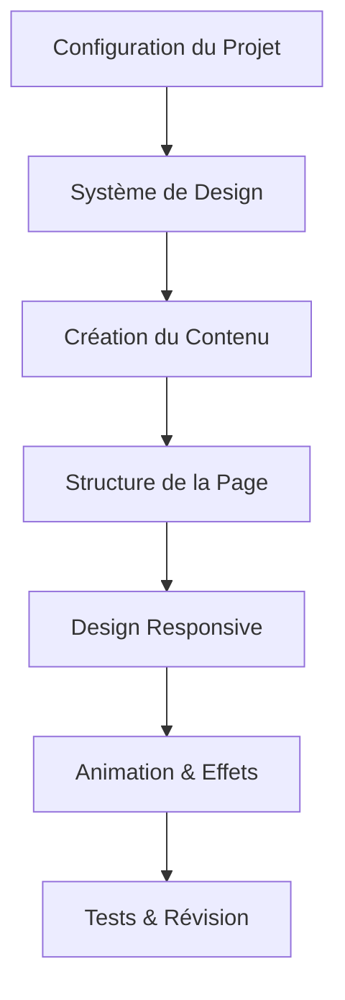
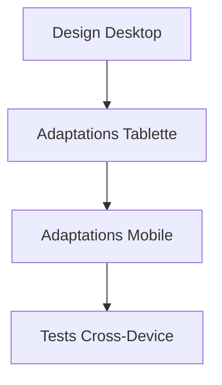

# "Cyborg Dev" - Plan de la Page d'Atterrissage

## Aperçu du Projet

Nous allons créer une page d'atterrissage sophistiquée avec une esthétique tech sombre pour "Cyborg Dev" - un cours premium sur l'évolution des développeurs à l'ère de l'IA agentique. La page sera entièrement responsive, rédigée en français, et utilisera Tailwind CSS pour le style.



## Système de Design

### Palette de Couleurs
- Arrière-plan Primaire: #050505 (plus sombre)
- Arrière-plan Secondaire: #080808 (très sombre)
- Arrière-plan Tertiaire: #0c0c0c (pour cartes)
- Couleurs d'Accent (Solides):
  - Orange-Rouge: #FF4931 (Primaire)
  - Violet: #9e57b3 (Secondaire)
  - Vert Vif: #1AFB6F (Tertiaire)
  - Bleu: #267AD2 (Liens/Autre)
- Couleurs de Texte:
  - Texte Primaire: #ffffff (blanc)
  - Texte Secondaire: #a0a0a0 (gris clair)
  - Texte Mis en Évidence: Couleurs d'accent solides

### Typographie
- Police de Titres: Inter (propre, moderne, professionnelle)
- Police de Corps: Roboto (excellente lisibilité)
- Tailles de Police:
  - Titre Héro: 3.5rem-4rem
  - Titres de Section: 2.5rem
  - Sous-titres: 1.5rem
  - Corps de Texte: 1rem
  - Petit Texte: 0.875rem

### Éléments de Design
- Arrière-plans très sombres avec contraste entre sections
- Motifs de grille subtils en arrière-plan avec couleurs d'accent
- Bordures solides ou effets de lueur avec couleurs d'accent
- Icônes minimalistes avec couleurs d'accent vives
- Animations subtiles de fondu et survol

## Structure de la Page

### En-tête
- Logo "Cyborg Dev" avec style personnalisé
- Navigation minimale (si nécessaire)
- Sélecteur de langue (optionnel)

### 1. Section Héro
- Titre puissant sur l'évolution des développeurs
- Sous-titre engageant expliquant la valeur du cours
- Formulaire de capture d'email avec bouton lumineux
- Arrière-plan avec une animation subtile de particules tech
- Superposition de dégradé sombre pour un meilleur contraste de texte

### 2. Section Défis
- Titre de section avec couleur d'accent solide
- 3-4 défis clés présentés en format carte
- Chaque défi comprend:
  - Icône ou représentation visuelle
  - Titre
  - Description
  - Statistique clé ou métrique d'impact
- Progression visuelle entre les défis
- Effets subtils au survol des cartes

### 3. Section Témoignages
- Titre de section avec couleur d'accent solide
- 3 témoignages d'experts dans des cartes sombres élégantes
- Chaque témoignage comprend:
  - Citation
  - Nom et références du leader de l'industrie
  - Entreprise/organisation
  - Statistique pertinente sur l'impact de l'IA
- Bordure ou effet de lueur solide sur les cartes de témoignage

### 4. Section Vision
- Titre tourné vers l'avenir avec couleur d'accent solide
- 3-4 points clés sur l'évolution des développeurs
- Représentation visuelle de la transformation
- Liste des compétences cruciales pour l'adaptation
- CTA final pour l'inscription avec élément d'urgence
- Arrière-plan avec motif tech subtil

### Pied de Page
- Informations de copyright
- Liens minimaux (Confidentialité, Conditions, etc.)
- Icônes de médias sociaux (si nécessaire)
- Petit élément de marque

## Stratégie de Contenu (Tout en Français)

### Section Héro
- Titre: Focus sur la transformation et l'opportunité
- Sous-titre: Adresser la peur du remplacement avec une vision d'augmentation
- CTA: Souligner l'exclusivité et l'inscription limitée

### Section Défis
- Focus sur les obstacles spécifiques auxquels les développeurs font face avec l'IA
- Inclure des statistiques réelles sur la transformation des emplois
- Présenter les défis comme des opportunités pour les développeurs préparés

### Section Témoignages
- Créer des citations fictives mais réalistes de leaders de l'industrie
- Mettre l'accent sur l'urgence de l'adaptation
- Inclure des métriques spécifiques sur l'adoption de l'IA dans le développement

### Section Vision
- Présenter une vision optimiste mais réaliste de l'évolution des développeurs
- Souligner la collaboration humain+IA
- Lister les compétences spécifiques qui resteront précieuses
- Créer un sentiment d'urgence pour l'inscription

## Stratégie de Design Responsive



### Desktop (>1024px)
- Mise en page complète avec éléments côte à côte
- Typographie et espacement plus grands
- Animations et effets riches

### Tablette (768px-1024px)
- Mises en page de grille ajustées
- Tailles de police légèrement réduites
- Animations préservées

### Mobile (<768px)
- Mises en page à colonne unique
- Tailles de police encore réduites
- Animations simplifiées
- Éléments interactifs adaptés au toucher
- Formulaire optimisé pour la saisie mobile

## Implémentation Technique

### Structure des Fichiers
```
/
├── index.html          # Fichier HTML principal
├── assets/
│   ├── css/            # Si du CSS personnalisé est nécessaire
│   ├── js/             # Pour JS minimal si requis
│   └── images/         # Pour images/icônes
```

### Technologies
- HTML5
- Tailwind CSS (via CDN pour simplicité)
- Google Fonts (Inter et Roboto)
- JavaScript vanilla minimal pour les interactions

### Considérations de Performance
- Optimiser les images pour le web
- Chargement paresseux du contenu hors écran
- Minimiser l'utilisation de JavaScript
- Implémenter des images responsives

## Stratégie d'Animation

- Animations subtiles de fondu à l'entrée au défilement
- Effets doux au survol des éléments interactifs
- Transitions fluides entre les états
- Effets de particules dans la section héro
- Texte mis en évidence avec couleurs d'accent solides

## Calendrier d'Implémentation

1. **Configuration & Structure** - Créer la structure HTML de base avec Tailwind
2. **Création de Contenu** - Rédiger tout le contenu en français pour chaque section
3. **Implémentation du Style** - Appliquer les classes Tailwind pour le design
4. **Adaptations Responsives** - Assurer un affichage correct sur tous les appareils
5. **Animations & Effets** - Ajouter des animations subtiles et des interactions
6. **Tests & Raffinement** - Tester sur différents appareils et navigateurs
7. **Révision Finale** - S'assurer que toutes les exigences sont satisfaites

## Livrables Clés

1. Page d'atterrissage entièrement responsive (index.html)
2. Tous les actifs nécessaires (images, icônes)
3. Documentation pour personnalisation ultérieure